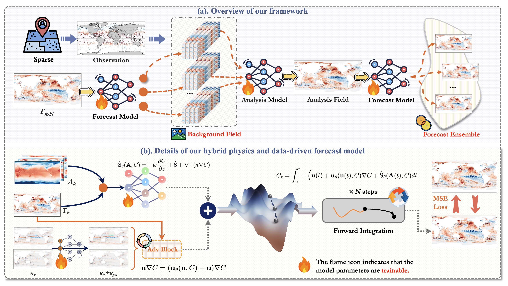

# Ocean-E2E
<p align="center" width="100%">
  
</p>
<div style="box-shadow: 2px 2px 10px rgba(0, 0, 0, 0.2); padding: 20px; border-radius: 15px; background-color: #f9f9f9;">
This repo is the official PyTorch implementation of Ocean-E2E: **Hybrid Physics-Based and Data-Driven Global Forecasting of Marine Heatwaves with End-to-End Neural Assimilation**.
This work focuses on the end-to-end forecast of global extreme marine heatwaves (MHWs), which are unusually warm sea surface temperature events with profound impacts on marine ecosystems. Accurate prediction of extreme MHWs has significant scientific and financial worth. However, existing methods still have certain limitations, especially in the most extreme MHWs. In this study, to address these issues, based on the physical nature of MHWs, we created a novel hybrid data-driven and numerical MHWs forecast framework Ocean-E2E, which is capable of 40-day accurate MHW forecasting with end-to-end data assimilation. Our framework significantly improves the forecast ability of extreme MHWs by explicitly modeling the effect of oceanic mesoscale advection and air-sea interaction based on a differentiable dynamic kernel. Furthermore, Ocean-E2E is capable of end-to-end MHWs forecast and regional high-resolution prediction using neural data assimilation approaches, allowing our framework to operate completely independently of numerical models while demonstrating high assimilation stability and accuracy, outperforming the current state-of-the-art ocean numerical forecasting-assimilation models. Experimental results show that the proposed framework performs excellently on global-to-regional scales and short-to-long-term forecasts, especially in those most extreme MHWs. Overall, our model provides a framework for forecasting and understanding MHWs and other climate extremes.
</div>

## Table of Contents
- [# Quick Start](#quick-start)
- [# Ocean-E2E Experiment: Regional High-resolution Simulation](#ocean-e2e-experiment-regional-high-resolution-simulation)
  - [## Overview](#overview-1)
  - [## Data Preparation](#data-preparation-1)
  - [## Training the Model](#training-the-model-1)
  - [## Inference with the Model](#inference-with-the-model-1)
  - [## Baseline Models](#baseline-models)
- [# Ocean-E2E Experiment: Global Low-resolution Simulation](#ocean-e2e-experiment-global-low-resolution-simulation)
  - [## Overview](#overview)
  - [## Data Preparation](#data-preparation)
  - [## Training the Model](#training-the-model)
  - [## Inference with the Model](#inference-with-the-model)

# Quick Start:
Here's a quick demo to get started with our Ocean-E2E (regional high-resolution) inference. This runs the two-step inference process:
```bash
# Step 1: Infer velocity model
CUDA_VISIBLE_DEVICES=0 python -m torch.distributed.launch --nproc_per_node=1 inference_vel.py --config config_vel.yaml
# Step 2: Infer main Oceane2e model
CUDA_VISIBLE_DEVICES=0 python -m torch.distributed.launch --nproc_per_node=1 inference.py --config config.yaml
# Check results
ls ./results/ # Should show Oceane2e_inputs.npy, Oceane2e_outputs.npy, etc.
```

# Ocean-E2E Experiment: Regional High-resolution Simulation 🌊
## Overview
This `./regional_high/` contains the implementation of the regional high-resolution experiments, designed for marine heatwave (MHW) prediction or related tasks using geophysical data. The model is the primary focus here, with supporting baselines available for comparison. The directory structure includes scripts for data loading, training, inference, and model definitions, along with checkpoints, logs, and results.
Key components:
- **Data**: Stored in `./data/GS/`, consisting of NetCDF files for surface geostrophic velocity (geo_*.nc) and MHW (mhw_*.nc) data from 1993 to 2020.
- **Models**: Oceane2e and baselines are defined in `./model_baselines/`.
- **Checkpoints**: Pre-trained models in `./checkpoints/` and `./checkpoints/pretrained/`.
- **Logs**: Training logs in `./logs/`.
- **Results**: Inference outputs (e.g., .npy files) in `./results/`.
- **Configs**: YAML files (e.g., config.yaml, config_vel.yaml) for hyperparameters.
- **Scripts**: Dataloader scripts (dataloader.py, dataloader_vel.py), training scripts (train_online.py, train_vel.py), and inference scripts (inference.py, inference_vel.py).
This README focuses exclusively on the Oceane2e model, as it is the main model. Training and inference are split into two steps: first handling the velocity/auxiliary model \(\mathcal{M}_{\theta}\) (using MultiConv), then the main Oceane2e model. All commands use Distributed Data Parallel (DDP) for multi-GPU training/inference, assuming 4 GPUs with `CUDA_VISIBLE_DEVICES=0,1,2,3`.
For baseline models (e.g., ConvLSTM, SimVP), you can run `inference_baseline.py` directly (details at the end).
## Data Preparation
The data is pre-organized in `./data/GS/` and requires minimal additional setup. It includes yearly NetCDF files:
- **geo_YYYY.nc**: Ocean surface geostrophic current data for year YYYY. Data size: $T \times C \times H \times W$, where T is time (365/366 days), C is channel (0 for u_g, 1 for v_g), H (480, longitude), W (600, latitude).
- **mhw_YYYY.nc**: MHW event data for year YYYY. Data size: $T \times C \times H \times W$, where T is time (365/366 days), C is channel (0 for ssta, 1 for zos, 2 for u10, 3 for v10, 4 for t2m), H (480, longitude), W (600, latitude).
- More detailed desription can be found in the appendix of our manuscript.
Years range from 1993 to 2020, suitable for training/validating (1993-2019) and testing/inference (2020).
### Steps to Prepare Data:
1. **Verify Data Integrity**: Ensure all `.nc` files are present in `./data/GS/`.
2. **Mask File**: Use `mask.npy` for masking invalid regions (e.g., land areas).
3. **Dataloaders**:
   - `dataloader_vel.py`: Handles data for the velocity model $\mathcal{M}_{\theta}$ (MultiConv).
   - `dataloader.py`: Handles data for the main Oceane2e model, integrating MHW data and outputs from $\mathcal{M}_{\theta}$.
 
4. **Configuration**: Edit `config_vel.yaml` for $\mathcal{M}_{\theta}$ (e.g., batch size, input channels) and `config.yaml` for Oceane2e (e.g., sequence length, learning rate). Ensure paths point to `./data/GS/`.
No further data augmentation or preprocessing is required beyond what's in the dataloaders. For custom data, place new `.nc` files in `./data/GS/` and update configs accordingly.
## Training the Model
Training Oceane2e is done in two sequential steps:
1. Train the velocity/auxiliary model $\mathcal{M}_{\theta}$ (MultiConv) to generate intermediate features.
2. Train the main Oceane2e model using outputs from Step 1.
### Step 1: Train $\mathcal{M}_{\theta}$ (Velocity Model)
- Script: `train_vel.py`
- Outputs: Checkpoints saved in `./checkpoints/` (e.g., MultiConv_best_model.pth). Logs in `./logs/MultiConv_training_log.log`.
Command:
```
CUDA_VISIBLE_DEVICES=0,1,2,3 python -m torch.distributed.launch --nproc_per_node=4 train_vel.py --config config_vel.yaml
```
### Step 2: Train Main Oceane2e Model
- Script: `train_online.py`
- This trains Oceane2e using MHW data and pre-computed features from $\mathcal{M}_{\theta}$.
- Outputs: Checkpoints in `./checkpoints/` (e.g., Oceane2e_best_model_*.pth). Logs in `./logs/Oceane2e_training_log.log` or similar.
Command:
```
CUDA_VISIBLE_DEVICES=0,1,2,3 python -m torch.distributed.launch --nproc_per_node=4 train_online.py --config config.yaml
```
## Inference with the Model
Inference follows a similar two-step process:
1. Infer with $\mathcal{M}_{\theta}$ to generate intermediate data.
2. Infer with the main Oceane2e model using the generated data, MHW test file, and mask.
Outputs are saved as .npy files in `./results/` (e.g., Oceane2e_inputs.npy, Oceane2e_outputs.npy).
### Step 1: Infer $\mathcal{M}_{\theta}$ (Velocity Model)
Command:
```
CUDA_VISIBLE_DEVICES=0 python -m torch.distributed.launch --nproc_per_node=1 inference_vel.py --config config_vel.yaml
```
### Step 2: Infer Main Oceane2e Model
Command:
```
CUDA_VISIBLE_DEVICES=0 python -m torch.distributed.launch --nproc_per_node=1 inference.py --config config.yaml
```
## Baseline Models
For comparison, baseline models (e.g., ConvLSTM, SimVP) can be inferred directly:
- Script: `inference_baseline.py`
- Loads from `./checkpoints/` (e.g., ConvLSTM_best_model.pth).
Command:
```
CUDA_VISIBLE_DEVICES=0 python -m torch.distributed.launch --nproc_per_node=1 inference_baseline.py --config config_baseline.yaml
```
- Outputs: In `./results/` (e.g., ConvLSTM_outputs.npy).

# Ocean-E2E Experiment: Global Low-resolution Simulation 🌍
## Overview
This `./global_low/` contains the implementation of the global low-resolution experiments, designed for marine heatwave (MHW) prediction or related tasks using geophysical data. The core logic is consistent with the regional high-resolution experiment, focusing on data loading, training, inference, and model definitions. However, it emphasizes baseline models for global-scale, lower-resolution simulations. The directory structure includes scripts for data loading, training, inference, and model definitions, along with checkpoints, logs, and results.
Key components:
- **Data**: Stored in `./data/`, with subdirectories for different sources: `./data/ERA5/` for atmospheric variables, `./data/highres/` for high-resolution SSTA, and `./data/low/` for low-resolution SSH-derived velocities. Data consists of NetCDF files from 1993 to 2020.
- **Models**: Baselines are defined in `./model_baselines/`.
- **Checkpoints**: Pre-trained models in `./checkpoints/`.
- **Logs**: Training logs in `./logs/`.
- **Results**: Inference outputs (e.g., .npy files) in `./results/`.
- **Configs**: YAML files (e.g., config.yaml, config_baseline.yaml) for hyperparameters.
- **Scripts**: Dataloader scripts (dataloader_05res.py, dataloader_baseline.py), training scripts (train_global_low.py, train_baseline.py), and inference scripts (inference_global_low.py, inference_baseline.py).
- **Mask File**: Use `mask.npy` for masking invalid regions (e.g., land areas).
This README focuses on the global low-resolution setup, which supports direct training and inference with baseline models (e.g., ConvLSTM, SimVP). All commands use Distributed Data Parallel (DDP) for multi-GPU training/inference, assuming 4 GPUs with `CUDA_VISIBLE_DEVICES=0,1,2,3`.
## Data Preparation
The data is pre-organized in `./data/` subdirectories and requires minimal additional setup. It includes yearly NetCDF files from multiple sources:
- **ERA5/025res_YYYY.nc**: Atmospheric data for year YYYY, channels: 2:u10, 3:v10, 4:t2m. Data size: $T \times C \times H \times W$, where T is time (365/366 days), C=5 channels, H=360, W=720.
- **highres/CMEMS_YYYY_norm.nc**: High-resolution normalized data for year YYYY, with variable 'ssta_highres' for sea surface temperature anomalies (SSTA).
- **low/SSH_low_processed_YYYY.nc**: Low-resolution processed SSH data for year YYYY, with variables 'ugos' (zonal geostrophic velocity) and 'vgos' (meridional geostrophic velocity).
- More detailed description can be found in the appendix of our manuscript.
Years range from 1993 to 2020, suitable for training/validating (1993-2019) and testing/inference (2020).
### Steps to Prepare Data:
1. **Verify Data Integrity**: Ensure all `.nc` files are present in `./data/ERA5/`, `./data/highres/`, and `./data/low/`.
2. **Mask File**: Use `mask.npy` for masking invalid regions.
3. **Dataloaders**:
   - `dataloader_05res.py`: Handles low-resolution data loading, combining inputs from ERA5 (channels [2,3,4]: u10, v10, t2m), low-resolution velocities (ugos, vgos), and highres SSTA. Loads sequences of 61 timesteps starting from dates in range(12, 357, 3) for training and range(12, 300, 3) for testing, with spatial downsampling (0:-1:2).
   - `dataloader_baseline.py`: Handles data for baseline models.

## Training the Model
Training for global low-resolution uses scripts focused on baseline models or the main global setup:
- Script: `train_global_low.py` for the primary global low-res model, or `train_baseline.py` for baselines.
- Outputs: Checkpoints saved in `./checkpoints/` (e.g., *_best_model.pth). Logs in `./logs/` (e.g., *_training_log.log).
Command for primary training, similar to regional high-res simulation:
```
CUDA_VISIBLE_DEVICES=0,1,2,3 python -m torch.distributed.launch --nproc_per_node=4 train_vel.py --config config_vel.yaml
CUDA_VISIBLE_DEVICES=0,1,2,3 python -m torch.distributed.launch --nproc_per_node=4 train_global_low.py --config config.yaml
```
For baselines:
```
CUDA_VISIBLE_DEVICES=0,1,2,3 python -m torch.distributed.launch --nproc_per_node=4 train_baseline.py --config config_baseline.yaml
```
## Inference with the Model
Inference uses corresponding scripts:
- Script: `inference_global_low.py` for the primary model, or `inference_baseline.py` for baselines.
- Outputs: Saved as .npy files in `./results/` (e.g., *_inputs.npy, *_outputs.npy).
Command for primary inference:
```
CUDA_VISIBLE_DEVICES=0 python -m torch.distributed.launch --nproc_per_node=1 inference_vel.py --config config_vel.yaml
CUDA_VISIBLE_DEVICES=0 python -m torch.distributed.launch --nproc_per_node=1 inference_global_low.py --config config.yaml
```
For baselines:
```
CUDA_VISIBLE_DEVICES=0 python -m torch.distributed.launch --nproc_per_node=1 inference_baseline.py --config config_baseline.yaml
```

## Acknowledgement
We appreciate the following github repos a lot for their valuable code base or datasets.
# Baseline Models in our global/regional simulations:
Most of the baseline implementations refer to this open source library: https://github.com/easylearningscores/TurbL1_AI4Science
SimVP: https://github.com/chengtan9907/OpenSTL
CNO: https://github.com/camlab-ethz/ConvolutionalNeuralOperator
LSM: https://github.com/thuml/Latent-Spectral-Models
PastNet: https://github.com/easylearningscores/PastNet
DiT: https://github.com/facebookresearch/DiT
