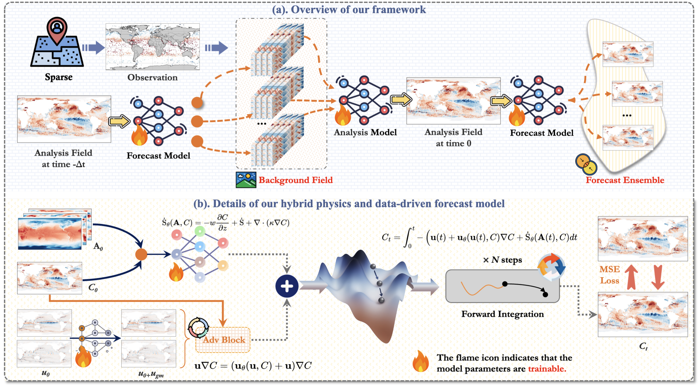

# Ocean-E2E
<p align="center" width="100%">
  
</p>

This repo is the official PyTorch implementation of Ocean-E2E: **Hybrid Physics-Based and Data-Driven Global Forecasting of Marine Heatwaves with End-to-End Neural Assimilation**.

This work focuses on the end-to-end forecast of global extreme marine heatwaves (MHWs), which are unusually warm sea surface temperature events with profound impacts on marine ecosystems. Accurate prediction of extreme MHWs has significant scientific and financial worth. However, existing methods still have certain limitations, especially in the most extreme MHWs. In this study, to address these issues, based on the physical nature of MHWs, we created a novel hybrid data-driven and numerical MHWs forecast framework Ocean-E2E, which is capable of 40-day accurate MHW forecasting with end-to-end data assimilation. Our framework significantly improves the forecast ability of extreme MHWs by explicitly modeling the effect of oceanic mesoscale advection and air-sea interaction based on a differentiable dynamic kernel. Furthermore, Ocean-E2E is capable of end-to-end MHWs forecast and regional high-resolution prediction using neural data assimilation approaches, allowing our framework to operate completely independently of numerical models while demonstrating high assimilation stability and accuracy, outperforming the current state-of-the-art ocean numerical forecasting-assimilation models. Experimental results show that the proposed framework performs excellently on global-to-regional scales and short-to-long-term forecasts, especially in those most extreme MHWs. Overall, our model provides a framework for forecasting and understanding MHWs and other climate extremes. 

# Ocean-E2E Experiment: Regional High-resolution Simulation

## Overview

This  `./regional_high/` contains the implementation of the regional high-resolution experiments, designed for marine heatwave (MHW) prediction or related tasks using geophysical data. The model is the primary focus here, with supporting baselines available for comparison. The directory structure includes scripts for data loading, training, inference, and model definitions, along with checkpoints, logs, and results.

Key components:
- **Data**: Stored in `./data/GS/`, consisting of NetCDF files for surface geostrophic velocity (geo_*.nc) and MHW (mhw_*.nc) data from 1993 to 2020.
- **Models**: Oceane2e and baselines are defined in `./model_baselines/`.
- **Checkpoints**: Pre-trained models in `./checkpoints/` and `./checkpoints/pretrained/`.
- **Logs**: Training logs in `./logs/`.
- **Results**: Inference outputs (e.g., .npy files) in `./results/`.
- **Configs**: YAML files (e.g., config.yaml, config_vel.yaml) for hyperparameters.
- **Scripts**: Dataloader scripts (dataloader.py, dataloader_vel.py), training scripts (train_online.py, train_vel.py), and inference scripts (inference.py, inference_vel.py).

This README focuses exclusively on the Oceane2e model, as it is the main model. Training and inference are split into two steps: first handling the velocity/auxiliary model \(\mathcal{M}_{\theta}\) (using MultiConv), then the main Oceane2e model. All commands use Distributed Data Parallel (DDP) for multi-GPU training/inference, assuming 4 GPUs with `CUDA_VISIBLE_DEVICES=0,1,2,3`.

For baseline models (e.g., ConvLSTM, SimVP), you can run `inference_baseline.py` directly (details at the end).

## Data Preparation

The data is pre-organized in `./data/GS/` and requires minimal additional setup. It includes yearly NetCDF files:

- **geo_YYYY.nc**: Geophysical data (e.g., currents, temperatures) for year YYYY.
- **mhw_YYYY.nc**: MHW event data for year YYYY.

Years range from 1993 to 2020, suitable for training (1993-2019) and testing/inference (2020).

### Steps to Prepare Data:
1. **Verify Data Integrity**: Ensure all `.nc` files are present in `./data/GS/`. No download is needed if the directory is complete.
2. **Mask File**: Use `mask.npy` for masking invalid regions (e.g., land areas).
3. **Dataloaders**:
   - `dataloader_vel.py`: Handles data for the velocity model \(\mathcal{M}_{\theta}\) (MultiConv).
   - `dataloader.py`: Handles data for the main Oceane2e model, integrating MHW data and outputs from \(\mathcal{M}_{\theta}\).
   
   These scripts load data in batches, apply normalizations, and prepare sequences for time-series modeling.

4. **Configuration**: Edit `config_vel.yaml` for \(\mathcal{M}_{\theta}\) (e.g., batch size, input channels) and `config.yaml` for Oceane2e (e.g., sequence length, learning rate). Ensure paths point to `./data/GS/`.

No further data augmentation or preprocessing is required beyond what's in the dataloaders. For custom data, place new `.nc` files in `./data/GS/` and update configs accordingly.

## Training the Model

Training Oceane2e is done in two sequential steps:
1. Train the velocity/auxiliary model \(\mathcal{M}_{\theta}\) (MultiConv) to generate intermediate features.
2. Train the main Oceane2e model using outputs from Step 1.

Use DDP for distributed training on 4 GPUs. Set `CUDA_VISIBLE_DEVICES=0,1,2,3` in your environment.

### Step 1: Train \(\mathcal{M}_{\theta}\) (Velocity Model)
- Script: `train_vel.py`
- This trains MultiConv on geophysical data to predict velocities or related fields.
- Outputs: Checkpoints saved in `./checkpoints/` (e.g., MultiConv_best_model.pth). Logs in `./logs/MultiConv_training_log.log`.

Command:
```
CUDA_VISIBLE_DEVICES=0,1,2,3 python -m torch.distributed.launch --nproc_per_node=4 train_vel.py --config config_vel.yaml
```

- **Hyperparameters**: Defined in `config_vel.yaml` (e.g., epochs, optimizer).
- **Data Used**: geo_*.nc files from 1993-2019.
- **Expected Duration**: Depends on hardware; monitor logs for progress.

### Step 2: Train Main Oceane2e Model
- Script: `train_online.py`
- This trains Oceane2e using MHW data and pre-computed features from \(\mathcal{M}_{\theta}\).
- Outputs: Checkpoints in `./checkpoints/` (e.g., Oceane2e_best_model_*.pth). Logs in `./logs/Oceane2e_training_log.log` or similar.

Command:
```
CUDA_VISIBLE_DEVICES=0,1,2,3 python -m torch.distributed.launch --nproc_per_node=4 train_online.py --config config.yaml
```

- **Hyperparameters**: Defined in `config.yaml`.
- **Data Used**: mhw_*.nc files from 1993-2019, integrated with \(\mathcal{M}_{\theta}\) outputs.
- **Notes**: Ensure Step 1 is complete before running. Training is "online" style, possibly incorporating real-time updates.

After training, best models are saved for inference.

## Inference with the Model

Inference follows a similar two-step process:
1. Infer with \(\mathcal{M}_{\theta}\) to generate intermediate data.
2. Infer with the main Oceane2e model using the generated data, MHW test file, and mask.

Use DDP for multi-GPU inference. Outputs are saved as .npy files in `./results/` (e.g., Oceane2e_inputs.npy, Oceane2e_outputs.npy).

### Step 1: Infer \(\mathcal{M}_{\theta}\) (Velocity Model)
- Script: `inference_vel.py`
- Loads pre-trained MultiConv from `./checkpoints/pretrained/MultiConv_best_model.pth`.
- Generates: `./data/GS/MultiConv_data.nc` (intermediate velocity predictions).

Command:
```
CUDA_VISIBLE_DEVICES=0,1,2,3 python -m torch.distributed.launch --nproc_per_node=4 inference_vel.py --config config_vel.yaml
```

- **Data Used**: geo_2020.nc (test year).
- **Notes**: This step populates MultiConv_data.nc for the next step.

### Step 2: Infer Main Oceane2e Model
- Script: `inference.py`
- Loads pre-trained Oceane2e from `./checkpoints/` (e.g., Oceane2e_best_model_*.pth).
- Integrates: `./data/GS/mhw_2020.nc`, `mask.npy`, and MultiConv_data.nc from Step 1.

Command:
```
CUDA_VISIBLE_DEVICES=0,1,2,3 python -m torch.distributed.launch --nproc_per_node=4 inference.py --config config.yaml
```

- **Data Used**: mhw_2020.nc, mask.npy, and MultiConv_data.nc.
- **Outputs**: Predictions in `./results/` (e.g., Oceane2e_outputs.npy). Visualize with `results/vis.ipynb` if needed.

## Baseline Models

For comparison, baseline models (e.g., ConvLSTM, SimVP) can be inferred directly:
- Script: `inference_baseline.py`
- Loads from `./checkpoints/` (e.g., ConvLSTM_best_model.pth).

Command:
```
CUDA_VISIBLE_DEVICES=0,1,2,3 python -m torch.distributed.launch --nproc_per_node=4 inference_baseline.py --config config_baseline.yaml
```

- Outputs: In `./results/` (e.g., ConvLSTM_outputs.npy).
- Training baselines: Use `train_baseline.py` similarly, but this is not the focus.
